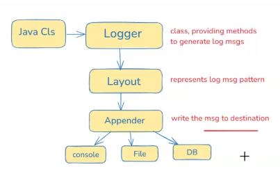
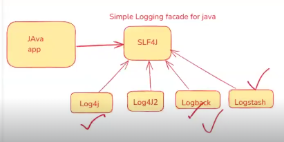

## What is Logging & Why it is used ?

* The process of storing application execution details into a __file/console__ is called as Logging.

* Log messages will help us in understanding runtime behaviour of the application.

* Using log msgs we can identify root cause of the exceptions.

* To implement logging there are several __logging frameworks__ available in the market.

    * <mark>__Log4J__
    * <mark>__Log4J2__
    * <mark>__Logback__
    * <mark>__Logstash__

## Logging Architecture :

* __Logger :__

   * Logger is a predefined class and it is providing several methods to generate log msgs.

   * __EX:__ trace(), debug(), info(), warn(), error()

   * __NOTE:__ For every java class we will create one logger object.

* __Layout:__

  * Layout represents log msg pattern.

  * `<date> <time> <class-name> <msg>`

* __Appender:__

  * Appender is used to write the log msg to destination.

  * __EX:__ ConsoleAppender , FileAppender, JdbcAppender

    

## Log Levels :

* To write log msgs to the destination we have several __LOG LEVELS__ as below :


   * __TRACE__

   * __DEBUG__

   * __INFO__ (Default LOG LEVEL in SpringBoot)

   * __WARN__

   * __ERROR__

* Log Messages will be printed based on the log level of our application , From current LOG LEVEL , it will print all the higher log level messages.

   * If __LOG LEVEL__ is __INFO__ , it will print __'INFO + WARN + ERROR' msgs.__

   * If __LOG LEVEL__ is __WARN__ , it will print __'WARN + ERROR' msgs.__

   * If __LOG LEVEL__ is __DEBUG__ , it will print __'DEBUG + INFO + WARN + ERROR' msgs.__

   * If __LOG LEVEL__ is __ERROR__ , it will print __'ERROR' msgs.__ 

* We can change application log level by using below property in application.properties file

   * __logging.level.root__ = ERROR

* By default, spring boot will use console appender hence log msgs will be printed on console.

* To print log msgs in log file, we can configure below property

   * __logging.file.name__ = ashokit.log

## Logging with Rolling Policy :

* It is used to create multiple log files to store log msgs of our application.

* Rolling Policy we can implement in 2 ways

   * __Size based rolling__

   * __Time based rolling__

* __Size Based rolling means after reaching given limit then new log file will be created.__

   * __Ex : 1 GB__

* __Time Based rolling means every day new log file should be created.__

* To configure rolling policy, we can use __logback.xml file.__	

## What is logback.xml ?

* logback.xml is used to customize logging in our application.

* In logback.xml we will configure below components

	* __Rolling File Appender with policy__

	* __Log Msg Pattern__

	* __Log Level__

* We will keep "logback.xml" under __"src/main/resources"__  folder	

```xml

<configuration>

	<appender name="RollingFile"
		class="ch.qos.logback.core.rolling.RollingFileAppender">
		<file>ashokit.log</file>
		<encoder>
			<pattern>%d [%thread] %-5level %-50logger{40} - %msg%n</pattern>
		</encoder>
		<rollingPolicy
			class="ch.qos.logback.core.rolling.SizeAndTimeBasedRollingPolicy">
			<fileNamePattern>ashokit-%d{yyyy-MM-dd}.%i.log</fileNamePattern>
			<maxFileSize>1GB</maxFileSize>
			<maxHistory>30</maxHistory>
		</rollingPolicy>
	</appender>
	<root level="INFO">
		<appender-ref ref="RollingFile" />
	</root>

</configuration>
```
__<mark>NOTE:__ If we implement Logging with both Console and File Appender both , then the performance would be impacted & File Logging is recommended.

__<mark>NOTE:__ Rolling File is recommended over Normal File __(because its a single file)__

## Log4J VS SLF4J:

* Log4J is a direct Logging Framework , but SLF4J is an abstraction for the Logging.

* SLF4J is recommended because our application will be loosely coupled with the Logging Framework.

   

## What is @SLF4J Annotation ?

* It is an alternative to create the Logger Object if we are using Project Lombok.

## Log Monitoring

* The process of getting log msgs from the log file is called as Log Monitoring.

* To monitor log files we have several tools in the market

   *  __Splunk (licensed)__

  * __ELK (free)__

  * __Putty / mobaxterm / gitbash / winscp__

  


